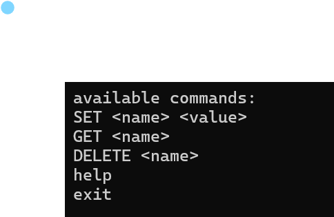

# Nano
Nano is a persistent, secure, key-value store I built from scratch in python to understand how sockets, async i/o, and LSM Trees work 

## Usage

Clone the repository 
```sh
$ git clone https://github.com/SujayKarpur/plox.git
$ cd plox
```

Set up and activate a python virtual environment
```sh
$ python3 -m venv venv
$ source venv/bin/activate
$ pip install -r requirements.txt
```

Start the server
```sh
$ ./nano
```

Open a new tab and run the client
```sh
$ python client.py
```

## API
-fill

## I. Key Value Stores
key-value stores are the simplest kind of databases - they are just mappings from keys to values.

Nano implements a basic in-memory key-value store using python dictionaries that supports some simple operations:




## II. Networking


## III. Handling Multiple Clients


## IV. Concurrent Client Handling


## V. Persistence

## VI. LSM Trees 

## VII. Security 

## VIII. Rewrite in Go

## IX. Distribute 

## X. Future Improvements
